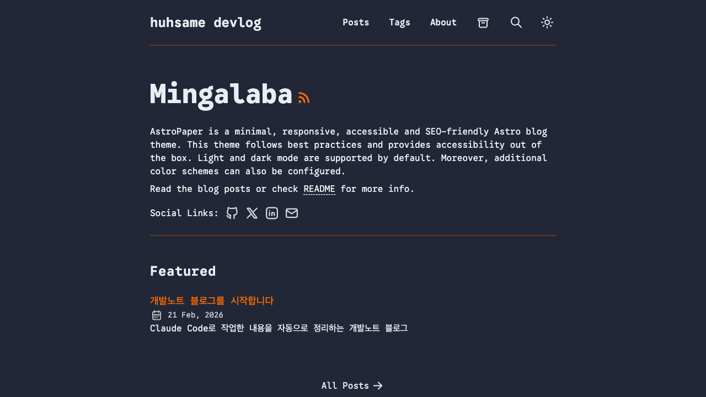

## TL;DR
- AI 뉴스를 RSS로 수집해서 Threads에 자동 포스팅하는 시스템을 만들었다
- Claude Code의 "스킬"과 "에이전트"를 활용한 자동화 파이프라인
- 이 작업 자체를 자동으로 기록하는 개발노트 블로그까지 구축

## 배경

매일 AI 뉴스를 읽고 Threads에 공유하고 싶은데, 수동으로 하면 귀찮다. Claude Code에는 "스킬"(재사용 가능한 작업 템플릿)이라는 기능이 있어서, 뉴스 수집 → 요약 → 포스팅을 자동화할 수 있겠다 싶었다.

그리고 이렇게 뭔가 만들 때마다 "오늘 뭐 했지?" 하고 기억을 더듬게 되는데, Claude Code 세션 로그에 다 남아있으니까 이것도 자동으로 정리해서 블로그로 만들면 좋겠다고 생각했다.

## 과정

### 1단계: AI 뉴스 수집 스킬 만들기

**프롬프트**:
> AI 뉴스 자동화 에이전트 프로젝트 브리핑
> 목표: AI 뉴스를 자동으로 크롤링 → 요약 → Threads에 포스팅하는 Claude Code 기반 자동화 시스템을 구축한다.
> 스킬은 범용적으로 설계하여 다른 프로젝트에서도 재사용할 수 있도록 한다.
> (+ 구체적인 소스 목록, API 설정, 스케줄링 방식까지 약 15,000자 브리핑)

**왜 이렇게 프롬프트를 짰나**:
15,000자짜리 상세 브리핑을 한 번에 줬다. 이게 핵심인데, Claude Code에서는 "Plan 모드"(코드 수정 전에 계획만 먼저 세우는 모드)로 전체 아키텍처를 잡고, 승인 후에 구현하게 할 수 있다. 상세한 브리핑 + Plan 모드 조합이 가장 확실하다.

**Claude가 한 일**:
- `news-sources` 스킬: RSS 피드 수집 (TechCrunch, AI Times, OpenAI 블로그, HuggingFace 논문 등)
- `content-rewriter` 스킬: 영문 기사를 한국어 Threads 포스트로 변환
- `threads-api` 스킬: Threads API로 자동 게시
- 크론 스케줄 설정: 아침 8시 수집+게시, 점심 12시/저녁 6시 큐 게시

**결과**:
스킬 3개가 만들어졌고, 아침에 자동으로 AI 뉴스를 수집해서 하루 3번 Threads에 포스팅하는 시스템이 완성됐다.

### 2단계: 개발노트 자동화 블로그

**프롬프트**:
> 내가 오늘 클로드코드랑 대화한거 다 봐봐. 나 오늘 뭐했는지 정리하고싶어...

**왜 이렇게 프롬프트를 짰나**:
사실 이건 "이렇게 짜야지" 하고 쓴 게 아니라 진짜 그냥 한 말이다. 그런데 Claude가 알아서 세션 로그를 분석하는 방법을 조사하고, 블로그 프로젝트 계획까지 세워줬다. 바이브코딩의 묘미가 이런 거다 -- 완벽한 프롬프트가 아니어도 의도를 파악해준다.

**Claude가 한 일** (Task 병렬 에이전트로 동시에 조사):
- Claude Code 세션 로그 구조 분석 (`~/.claude/projects/` 디렉토리)
- Astro + AstroPaper 테마로 블로그 프로젝트 설계
- `session-analyzer` 스킬: JSONL 세션 로그를 파싱해서 프롬프트 통계, 도구 사용량, URL 추출
- `devlog-writer` 에이전트: 세션 분석 → 개발노트 마크다운 자동 생성
- `devlog-publisher` 에이전트: 빌드 → GitHub Pages 자동 배포

**결과**:

GitHub Pages에 자동 배포되는 블로그가 완성됐다. 지금 읽고 있는 이 글이 바로 이 시스템으로 만들어진 첫 번째 개발노트다.

## 프롬프트 회고

**잘 먹힌 프롬프트 패턴**:
- 상세 브리핑 + Plan 모드: 15,000자 브리핑을 Plan 모드로 검토하고 승인하니까, 전체 구조가 한 번에 잡혔다. 중간에 방향이 틀어지는 일이 없었다
- "스킬은 범용적으로 설계" 한 줄 추가: 이 한 줄 덕분에 news-sources 스킬이 다른 프로젝트에서도 재사용 가능한 구조로 나왔다
- 자연어로 의도 전달: "오늘 뭐했는지 정리하고싶어" 같은 느슨한 프롬프트도, 맥락이 충분하면 Claude가 구체적인 계획으로 발전시켜준다

**아쉬웠던 점**:
- Threads API 토큰 설정을 브리핑에 포함했으면 중간에 끊기지 않았을 것
- session-analyzer의 타임존 처리를 처음부터 명시했으면 좋았다 (UTC vs KST)

## 삽질 & 해결

- **문제**: session-analyzer가 "오늘" 세션을 못 찾음
- **원인**: 세션 로그 타임스탬프가 UTC인데, `--date today`는 로컬 시간(KST) 기준
- **해결**: UTC 2/20 = KST 2/21 이므로 날짜를 직접 지정해서 우회
- **프롬프트 팁**: 타임존 관련 로직은 처음부터 "KST 기준으로 동작해야 한다"고 프롬프트에 명시할 것

## 배운 것
- Claude Code의 스킬/에이전트 시스템은 "자동화 파이프라인"을 만들기에 딱 맞는 구조다
- Plan 모드 + 상세 브리핑 조합이 대규모 프로젝트에서 가장 효과적
- Task(병렬 에이전트)로 여러 조사를 동시에 돌리면 시간을 크게 절약할 수 있다
- 바이브코딩은 "완벽한 프롬프트"보다 "충분한 맥락 + 의도 전달"이 핵심

## 사용한 Claude Code 기능

| 기능 | 설명 | 어떻게 썼나 |
|------|------|-------------|
| Plan 모드 | 코드 수정 전에 계획만 먼저 세우는 모드 | ainews 전체 아키텍처를 플랜 모드로 잡고 승인 후 구현 |
| 스킬 | 재사용 가능한 작업 템플릿. `~/.claude/skills/`에 저장 | news-sources, content-rewriter, threads-api, session-analyzer 4개 생성 |
| 에이전트 | 특정 역할을 하는 AI 워커 | devlog-writer, devlog-publisher 2개 생성 |
| Task (병렬) | 여러 작업을 동시에 서브에이전트로 돌리는 기능 | 세션 로그 구조 조사 + 블로그 테마 조사를 병렬로 |
| MCP (Playwright) | 브라우저를 코드로 조작하는 외부 도구 | 결과물 스크린샷 자동 수집 |
| TodoWrite | 작업 목록 관리 | 6단계 구현을 투두로 나눠서 진행 추적 |
| 웹 검색/조회 | 실시간 웹 검색 | Threads API 문서, AstroPaper 테마 조사 |

## 도구 사용 통계

**ainews 세션** (131분, 프롬프트 39개):
| 도구 | 횟수 | 용도 |
|------|------|------|
| Read | 55 | 기존 코드/설정 분석 |
| Write | 24 | 스킬 파일, 스크립트 생성 |
| Bash | 15 | API 테스트, 크론 설정 |
| WebFetch | 13 | RSS 피드, API 문서 조회 |
| Task | 4 | 병렬 리서치 |

**devlog 세션** (약 20분, 프롬프트 14개):
| 도구 | 횟수 | 용도 |
|------|------|------|
| Bash | 47 | 프로젝트 생성, 빌드, 배포 |
| Read | 15 | 기존 테마 구조 분석 |
| Edit | 10 | 설정 수정 |
| Write | 7 | 스킬, 에이전트, 워크플로우 생성 |

## 링크
- **GitHub**: [devlog 블로그](https://github.com/huhsame/devlog), [cron-dashboard](https://github.com/huhsame/cron-dashboard)
- **결과물**: [devlog 블로그](https://huhsame.github.io/devlog/), [Threads @huhsame.ai](https://www.threads.net/@huhsame.ai)
- **참고**: [AstroPaper 테마](https://github.com/satnaing/astro-paper), [Threads API 문서](https://developers.facebook.com/docs/threads), [Claude Code 스킬 문서](https://code.claude.com/docs/en/skills)
