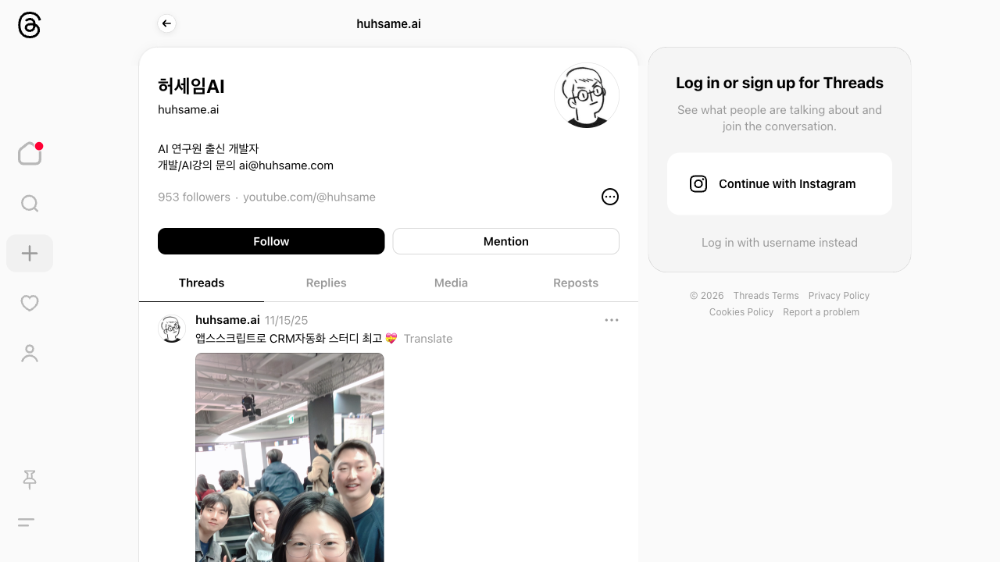

## TL;DR
- AI 뉴스를 RSS로 수집해서 한국어로 요약하고 Threads에 자동 포스팅하는 시스템을 만들었다
- Claude Code의 "스킬"을 활용해서 뉴스 수집, 콘텐츠 변환, 포스팅을 모듈화했다
- 아침 8시에 자동 수집, 하루 3번 자동 게시

## 배경

매일 AI 뉴스를 읽고 Threads에 공유하고 싶은데, 수동으로 하면 귀찮다. TechCrunch, AI Times, OpenAI 블로그 같은 곳을 매번 돌아다니면서 기사 고르고, 한국어로 요약하고, Threads에 올리고... 이걸 자동화하면 좋겠다 싶었다.

Claude Code에는 "스킬"(재사용 가능한 작업 템플릿)이라는 기능이 있어서, 뉴스 수집 → 요약 → 포스팅을 각각 스킬로 만들면 되겠다고 생각했다.

## 과정

### 1단계: 전체 구조 설계 (Plan 모드)

**프롬프트**:
> AI 뉴스 자동화 에이전트 프로젝트 브리핑
> 목표: AI 뉴스를 자동으로 크롤링 → 요약 → Threads에 포스팅하는 Claude Code 기반 자동화 시스템을 구축한다.
> 스킬은 범용적으로 설계하여 다른 프로젝트에서도 재사용할 수 있도록 한다.
> (+ 환경, 전체 구조, 소스 목록, API 설정, 스케줄링 방식까지 약 15,000자 브리핑)

**왜 이렇게 프롬프트를 짰나**:
15,000자짜리 상세 브리핑을 한 번에 줬다. 이게 핵심인데, Claude Code에서는 "Plan 모드"(코드 수정 전에 계획만 먼저 세우는 모드)로 전체 아키텍처를 잡고, 승인 후에 구현하게 할 수 있다. 상세한 브리핑 + Plan 모드 조합이 가장 확실하다. 그리고 "스킬은 범용적으로 설계" 한 줄을 넣었더니, 각 스킬이 다른 프로젝트에서도 재사용 가능한 구조로 나왔다.

**Claude가 한 일**:
- 전체 아키텍처를 Plan 모드로 설계
- 스킬 3개 + 에이전트 3개 구조 제안
- 승인 후 순차적으로 구현

### 2단계: 뉴스 수집 스킬 (news-sources)

RSS 피드에서 AI 뉴스를 수집하는 스킬을 만들었다. 소스는 YAML 파일로 관리해서 나중에 쉽게 추가/제거할 수 있다.

**현재 수집 소스**:
- TechCrunch AI, The Verge AI
- AI Times (한국),
- OpenAI Blog, Google DeepMind Blog, HuggingFace Blog
- Anthropic News, xAI Blog, Meta AI Blog
- HuggingFace Daily Papers (논문)

### 3단계: 콘텐츠 변환 스킬 (content-rewriter)

영문 기사를 한국어 Threads 포스트로 변환하는 스킬이다. 핵심은 톤 설정이었는데, "이모지 없이, 전문적이면서 개인 감상을 곁들인" 스타일로 지정했다.

**프롬프트**:
> 스레드에 올릴때 내 말투로 올리고싶은데 그부분 어떻게되어있는지 확인해줘. 나는 이모지 싫고.. 습니다 입니다 이런 말투이길원해 전문적으로. 좀 개인적으로 이 뉴스를 읽고 내 의견이나 감상, 느낌을 같이 전하는 것처럼 하고싶어.

기사 중에 사진이 있는 건 이미지도 함께 가져오도록 했다. 디바이스 사진이나 차트처럼 시각적으로 의미 있는 경우만 선정.

### 4단계: Threads API 연동 (threads-api)

Meta Threads API로 자동 게시하는 스킬이다. 2단계 API 호출(컨테이너 생성 → 게시)을 자동 처리한다.

**삽질**: Threads API 토큰 설정을 브리핑에 포함 안 해서 중간에 끊겼다. Meta 개발자 앱 설정부터 토큰 발급까지 별도로 진행해야 했다.

### 5단계: 크론 스케줄 설정

수집과 게시를 crontab으로 자동화했다:
- 아침 8시: 뉴스 수집 + 1차 게시
- 점심 12시: 큐에서 2차 게시
- 저녁 6시: 큐에서 3차 게시

하루에 한 번 수집하고, 선정된 기사들을 시간차를 두고 3번에 나눠서 올리는 구조다.

**결과**:

## 프롬프트 회고

**잘 먹힌 프롬프트 패턴**:
- 상세 브리핑 + Plan 모드: 15,000자 브리핑을 Plan 모드로 검토하고 승인하니까, 전체 구조가 한 번에 잡혔다. 중간에 방향이 틀어지는 일이 없었다
- "스킬은 범용적으로 설계" 한 줄 추가: 이 한 줄 덕분에 news-sources 스킬이 다른 프로젝트에서도 재사용 가능한 구조로 나왔다

**아쉬웠던 점**:
- Threads API 토큰 설정을 브리핑에 포함했으면 중간에 끊기지 않았을 것
- 뉴스 선정 기준을 처음부터 더 구체적으로 지정했으면 좋았다

## 배운 것
- Claude Code의 스킬 시스템은 "자동화 파이프라인"을 만들기에 딱 맞는 구조다. 각 스킬이 독립적이라 조합이 자유롭다
- Plan 모드 + 상세 브리핑 조합이 대규모 프로젝트에서 가장 효과적
- RSS 피드는 여전히 뉴스 수집의 가장 안정적인 방법이다

## 사용한 Claude Code 기능

| 기능 | 설명 | 어떻게 썼나 |
|------|------|-------------|
| Plan 모드 | 코드 수정 전에 계획만 먼저 세우는 모드 | 전체 아키텍처를 플랜 모드로 잡고 승인 후 구현 |
| 스킬 | 재사용 가능한 작업 템플릿. `~/.claude/skills/`에 저장 | news-sources, content-rewriter, threads-api 3개 생성 |
| Task (병렬) | 여러 작업을 동시에 서브에이전트로 돌리는 기능 | RSS 소스 조사를 병렬로 |
| TodoWrite | 작업 목록 관리 | 구현 단계를 투두로 나눠서 진행 추적 |
| 웹 검색/조회 | 실시간 웹 검색 | Threads API 문서, RSS 피드 확인 |

## 도구 사용 통계

**ainews 세션** (131분, 프롬프트 39개):
| 도구 | 횟수 | 용도 |
|------|------|------|
| Bash | 88 | API 테스트, 크론 설정, 스크립트 실행 |
| Read | 55 | 기존 코드/설정 분석 |
| Edit | 46 | 스킬 파일 수정 |
| TodoWrite | 25 | 진행 추적 |
| Write | 24 | 스킬 파일, 스크립트 생성 |
| WebFetch | 13 | RSS 피드, API 문서 조회 |

## 링크
- **결과물**: [Threads @huhsame.ai](https://www.threads.net/@huhsame.ai)
- **참고**: [Threads API 문서](https://developers.facebook.com/docs/threads), [Claude Code 스킬 문서](https://code.claude.com/docs/en/skills)
