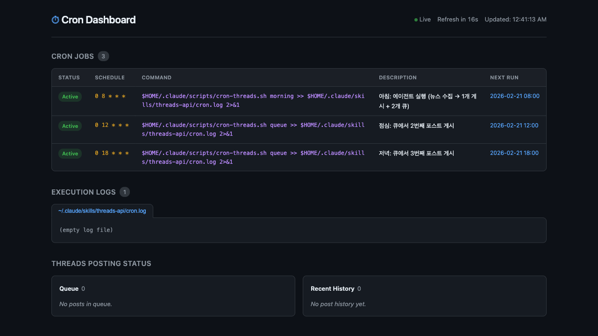

## TL;DR
- crontab에 등록된 크론 작업들을 웹 브라우저에서 한눈에 볼 수 있는 대시보드를 만들었다
- Flask 단일 파일(450줄), 다크 테마, 조회 전용
- 상세 브리핑 하나로 17분 만에 완성

## 배경

맥북을 홈서버로 쓰면서 크론 작업이 점점 늘어나고 있었다. AI 뉴스 수집, Threads 자동 포스팅 등등... `crontab -l`로 터미널에서 확인할 수 있지만, 다음 실행 시간이 언제인지, 로그는 어떤지 한눈에 보고 싶었다.

## 과정

### 1단계: 브리핑 한 방으로 구현

**프롬프트**:
> 크론 대시보드 프로젝트 전달 사항
> 목적: 맥에 설정된 crontab 크론 작업을 웹 브라우저에서 조회할 수 있는 로컬 대시보드.
> 요구사항: 조회 전용, Flask 단일 파일, 다크 테마...

**왜 이렇게 프롬프트를 짰나**:
"전달 사항" 형식으로 목적, 요구사항, 기술 스택을 구조화해서 적었다. 크론 대시보드 정도의 규모면 Plan 모드 없이 바로 구현해도 괜찮다. 대신 요구사항을 명확하게 적어야 한다.

**Claude가 한 일**:
- Flask 단일 파일 앱 (`app.py` 약 450줄)
- crontab 파싱 + 다음 실행 시간 계산 (croniter 라이브러리)
- 로그 파일 뷰어
- Threads 포스팅 큐/히스토리 표시
- 다크 테마 UI
- Playwright MCP(브라우저 자동화 도구)로 직접 결과물을 브라우저에서 확인

**결과**:

크론 작업 3개가 한눈에 보인다. 아침/점심/저녁 Threads 자동 포스팅 스케줄이 잘 등록되어 있다.

## 프롬프트 회고

**잘 먹힌 프롬프트 패턴**:
- "전달 사항" 형식의 구조화된 브리핑 → 한 번에 원하는 결과물이 나옴
- 기술 스택 직접 지정 (Flask 단일 파일) → 대안 추천 없이 바로 구현
- "조회 전용" 명시 → 불필요한 CRUD 기능을 안 만듦

**아쉬웠던 점**:
- 특별히 없다. 작은 프로젝트는 상세 브리핑 하나면 충분하다

## 배운 것
- 작은 프로젝트(단일 파일)는 Plan 모드 없이 상세 브리핑 하나로 충분하다
- croniter 라이브러리로 크론 표현식의 다음 실행 시간을 쉽게 계산할 수 있다
- Playwright MCP로 만든 결과물을 Claude가 직접 브라우저에서 확인해주니까 "이거 맞아?" 하고 물어볼 필요가 없다

## 사용한 Claude Code 기능

| 기능 | 설명 | 어떻게 썼나 |
|------|------|-------------|
| MCP (Playwright) | 외부 도구 연결 - 브라우저를 코드로 조작 | 대시보드 완성 후 브라우저로 직접 접속해서 UI 확인 |
| TodoWrite | 작업 목록 관리 | 구현 단계를 투두로 나눠서 체크 |

## 도구 사용 통계

**크론 대시보드 세션** (17분, 프롬프트 12개):
| 도구 | 횟수 | 용도 |
|------|------|------|
| Bash | 37 | Flask 실행, 패키지 설치 |
| TodoWrite | 4 | 진행 추적 |
| Write | 2 | app.py 생성 |
| MCP (Playwright) | 5 | 브라우저에서 결과물 확인/스크린샷 |

## 링크
- **GitHub**: [cron-dashboard](https://github.com/huhsame/cron-dashboard)
