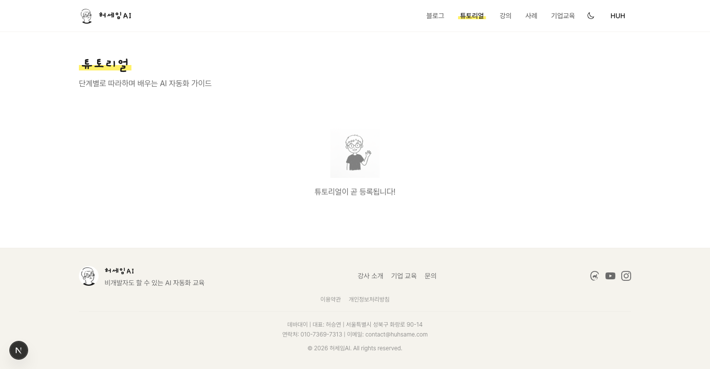
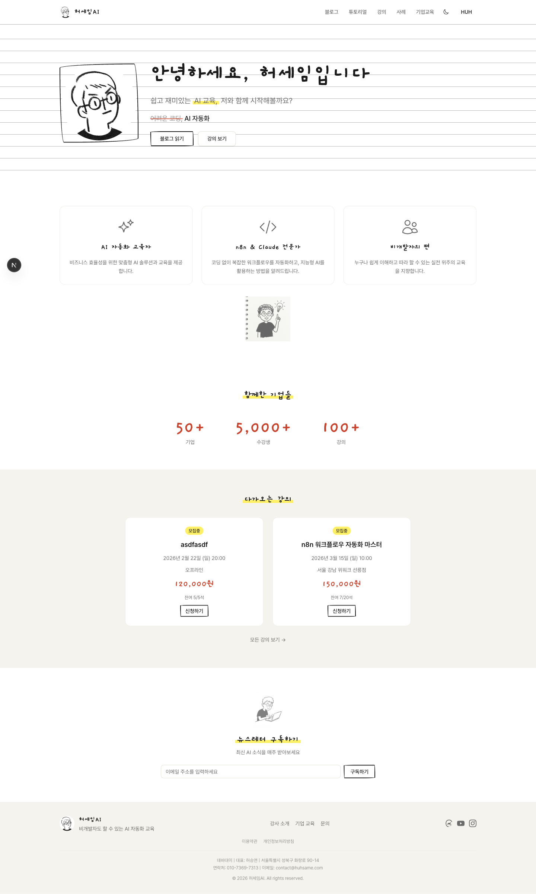
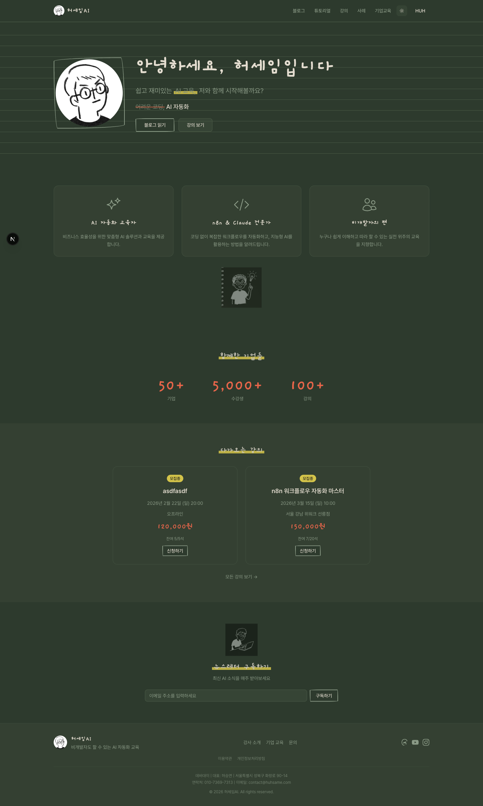
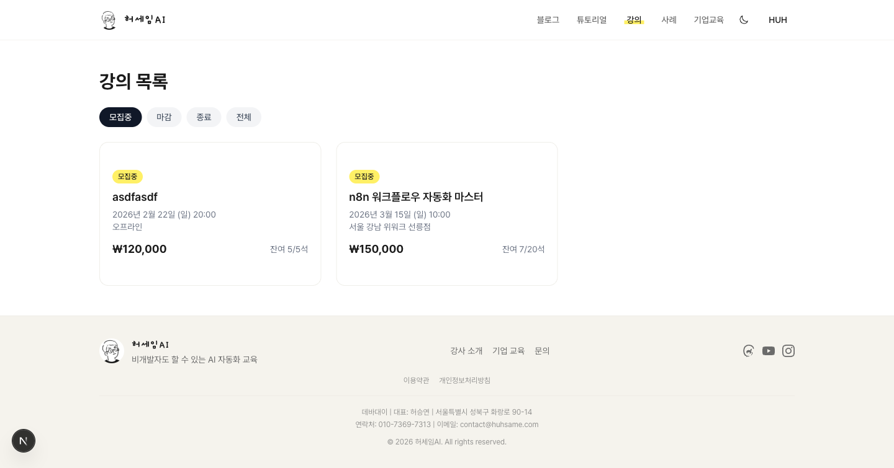
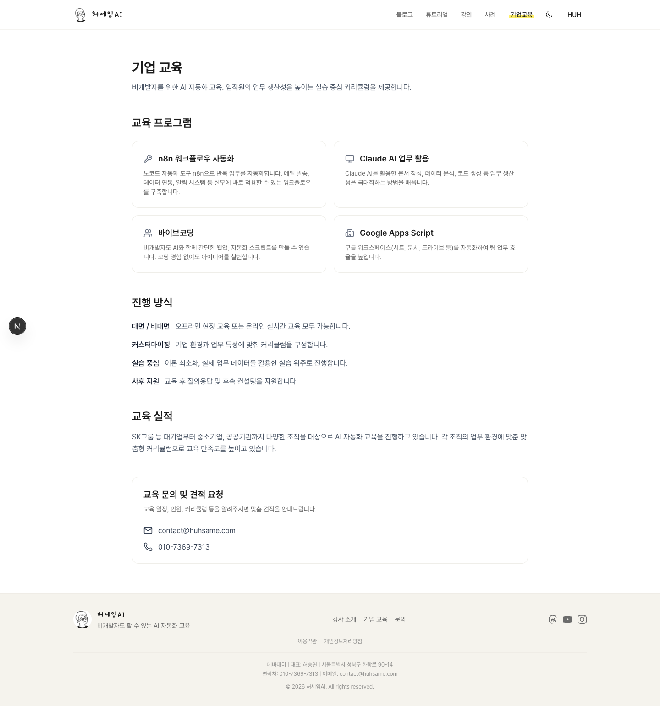
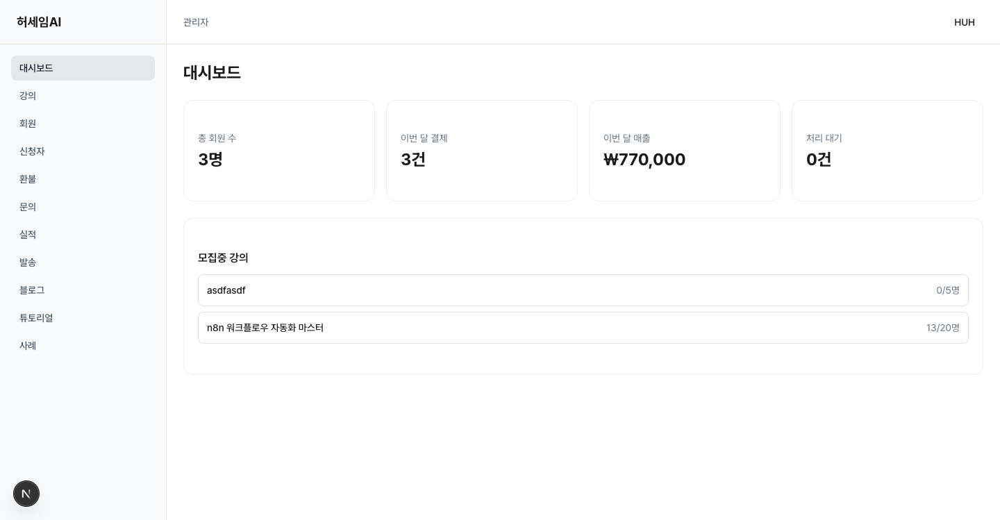
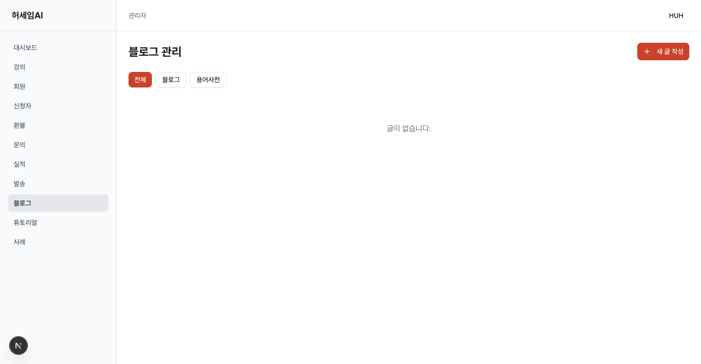

## TL;DR

- 허세임 플랫폼(huhsame.com)을 "강의 판매 사이트"에서 "공부하는 공간"으로 전환
- Next.js 기본 디자인 그대로였던 사이트를, "손으로 그린 기술" 컨셉의 디자인 시스템 위에 블로그/튜토리얼/쇼케이스를 얹는 구조로 리뉴얼
- 라이트 모드는 강의 노트, 다크 모드는 칠판과 분필. 같은 레이아웃에서 완전히 다른 분위기 전환
- Claude Code로 Phase를 나눠서 바이브코딩. 디자인 시스템을 코드로 먼저 정의해서 이후 컴포넌트 전체 일관성 확보

---

## 왜 리뉴얼이 필요했는지

### Before: Next.js 기본 디자인 그 자체

솔직히 말하면, 기존 사이트는 Next.js 프로젝트를 `create-next-app`으로 만들고 거기에 콘텐츠만 얹은 수준이었습니다. 로그인 안 한 사람이 보는 화면은 Three.js 애니메이션 하나가 전부였고요. 로그인하면 강의 3개와 교육 실적 로고 몇 개가 보이고, 그게 끝이었습니다.

문제는 이게 "웹사이트"라는 느낌이었다는 겁니다. 수강생 입장에서는 들어와서 강의 구매하고 나가는 쇼핑몰이죠. 저는 그게 아니라, 들어오면 뭔가 배우고 싶어지는 공간을 만들고 싶었습니다.

> 수강생들에게 웹사이트가 아니라 공부하는 공간이라는 느낌으로 다가가고 싶었다.

그래서 방향을 바꿨습니다. 강의는 있되, 블로그로 생각을 기록하고, 튜토리얼로 실습 자료를 올리고, 수강생이 만든 결과물이 쇼케이스에 자동으로 올라가는 구조로요. 홈페이지도 그에 맞게 완전히 다시 만들어야 했습니다.

### 왜 바이브코딩으로 접근했는지

디자인 시스템부터 DB 설계, API, 프론트엔드까지 혼자 다 하는 건 현실적으로 몇 주짜리 작업입니다. 그런데 바이브코딩이라는 방법이 있습니다. AI한테 의도를 설명하고, 코드를 생성하게 하고, 결과를 확인하면서 방향을 잡는 방식이요.

---

## 프롬프트에서 플랜까지 -- Claude와의 논의 과정

### 처음 입력한 프롬프트

처음부터 구체적인 기능 명세를 준 게 아닙니다. 그냥 하고 싶은 걸 말했습니다.

> 나 내 홈페이지를 리뉴얼하고싶은데, 의견을 좀 줘. 나는 강의판매도하지만 그게 주가 아니라 내 홍보하는 게 더 컷으면 좋겠어. ai블로그도 하고싶고.. 또 수강생들의 수강사례들도 보여주고싶어. 그리고 또 좋을거같은 아이디어나 그런거좀 보여줘. 디자인도 허세임브랜드 디자인가이드에 맞게 다시 개발하고싶고.

이게 전부였습니다. "블로그 하고 싶고, 수강사례 보여주고 싶고, 디자인 바꾸고 싶다." 여기서부터 대화가 시작됐습니다.

### 논의하면서 구체화된 것들

Claude가 아이디어를 제안하면, 제가 "이건 이렇게 하고 싶어"라고 방향을 잡는 식으로 진행했습니다. 핵심적인 논의 포인트가 몇 가지 있었습니다.

**블로그 + 튜토리얼 구조**: Claude가 블로그와 튜토리얼을 별도로 제안했는데, 저는 깃북 스타일 사이드바가 있는 튜토리얼을 원했습니다.

> 블로그를 그냥 블로그글을 올리기도하지만, 뭔가 ... 튜토리얼이나 그런거로도 만들고싶어 옆에 사이드바로 그 헤드라인들 보이는식으로? 깃북처럼?

**AI 용어사전 통합**: 처음에는 용어사전이 별도 기능으로 제안됐는데, 블로그와 합치자고 했습니다.

> ai 용어사전은 따로하지말고, 그 블로그랑 통합시키면 좋겠는데?

이 한마디로 `blog_posts` 테이블에 `content_type` 컬럼을 추가하는 설계가 나왔습니다.

**쇼케이스 자동 생성**: 이건 제가 가장 강하게 방향을 잡은 부분입니다. Claude는 수강생이 직접 사례를 작성하는 방식을 제안했는데, 저는 실습 결과가 자동으로 올라가는 걸 원했습니다.

> 아니야! 그 수강생쇼케이스는, 수강생이 튜토리얼에서 실습을 하면 거기서 자동으로 실습한 내용이 저장되어서 그걸로 쇼케이스에 보여주는걸로할거야.

이 대화가 튜토리얼 → 실습 제출 → 쇼케이스 자동 생성이라는 전체 흐름을 만들었습니다.

### Claude가 생성한 최종 플랜

논의가 끝나고, Claude Code의 Plan 모드를 사용해서 전체 구현 계획을 만들었습니다. Plan 모드는 코드를 바로 작성하지 않고 계획만 먼저 세우는 모드입니다. 승인하기 전까지는 파일을 건드리지 않습니다.

최종 플랜은 5개 Phase로 나뉘었습니다.

| Phase | 내용 | 주요 작업 |
|-------|------|-----------|
| 1 | 브랜드 디자인 시스템 | 폰트, 컬러, CSS 유틸리티, shadcn 리스타일 |
| 2 | 홈페이지 리뉴얼 | 7개 섹션 (히어로~뉴스레터), placeholder 데이터 |
| 3 | 블로그 시스템 | DB 마이그레이션, Tiptap 에디터, Admin CRUD, 태그 필터 |
| 4 | 튜토리얼 + 실습 + 쇼케이스 | DB 5개 테이블, 깃북 레이아웃, Agent API, 자동 쇼케이스 |
| 5 | 네비게이션 + 뉴스레터 | 메뉴 업데이트, DB 연동, 뉴스레터 구독 |

각 Phase마다 수정할 파일, 새로 만들 파일, API 라우트, DB 스키마가 구체적으로 명시되어 있었습니다. 이 플랜을 승인한 뒤, Phase 순서대로 "Phase 1 시작해줘", "Phase 2 시작해줘" 식으로 진행했습니다.

핵심은 Phase를 나누는 거였습니다. 한 번에 "다 만들어줘"라고 하면 방향이 흔들립니다. 각 Phase가 끝날 때마다 결과를 확인하고, 다음 Phase에 피드백을 반영하는 식입니다. 이게 바이브코딩에서 가장 중요한 부분이라고 생각합니다. AI가 문맥을 잃지 않는 범위 안에서 작업을 쪼개는 것이요.

---

## "손으로 그린 기술" -- 디자인 시스템 이야기

리뉴얼의 출발점은 디자인이었습니다. 개발 교육 플랫폼이니까, "강의 노트에 형광펜으로 밑줄 치고, 빨간펜으로 중요한 부분을 표시한" 그런 느낌을 주고 싶었습니다. 이 컨셉을 코드로 정의하는 게 Phase 1이었고요.

폰트는 Pretendard(본문), Gaegu(손글씨 강조), Geist Mono(코드)입니다. 브랜드 컬러는 잉크 블랙, 형광 노랑, 빨간펜, 크림색 종이로 잡았습니다.

그리고 이 컨셉을 CSS 유틸리티 클래스로 만들었습니다.

```css
/* 형광펜 밑줄 */
.highlight {
  background: linear-gradient(
    to bottom, transparent 55%,
    var(--highlighter-yellow) 55%,
    var(--highlighter-yellow) 90%,
    transparent 90%
  );
  display: inline;
  padding: 0 4px;
}

/* 손그림 테두리 */
.hand-drawn-border {
  border: 2px solid var(--ink-black);
  border-radius: 255px 15px 225px 15px / 15px 225px 15px 255px;
}

/* 줄노트 배경 */
.notebook-bg {
  background-image: repeating-linear-gradient(
    transparent, transparent 31px,
    var(--sketch-gray) 31px, var(--sketch-gray) 32px
  );
}
```

`.hand-drawn-border`의 `border-radius` 값이 핵심입니다. `255px 15px 225px 15px / 15px 225px 15px 255px` -- 이 비대칭 값이 사람이 자로 대지 않고 손으로 그린 듯한 불규칙한 테두리를 만듭니다. CSS만으로 이런 질감을 낼 수 있다는 게 재밌었습니다.

이 유틸리티 클래스들이 나머지 모든 Phase의 기반이 됐습니다. 디자인 시스템을 코드로 먼저 정의해두니까, 이후에 Claude가 컴포넌트를 만들 때마다 `.highlight`를 쓸 곳에는 형광펜을, `.hand-drawn-border`를 쓸 곳에는 손그림 테두리를 일관되게 적용했습니다. 말로 "이런 디자인으로 해줘"라고 하는 것과, 코드로 정의해서 "이 클래스를 써"라고 하는 건 결과물이 완전히 다릅니다.

---

## 콘텐츠가 살아 움직이는 공간 만들기

디자인 시스템이 잡히고 나면, 그 위에 실제 기능을 올릴 차례입니다. "공부하는 공간"이라는 느낌을 주려면, 단순히 예쁜 홈페이지가 아니라 콘텐츠가 흐르는 구조가 필요했습니다. 블로그로 생각을 기록하고, 튜토리얼로 실습하고, 그 결과물이 쇼케이스로 모이는 흐름이요.

### 블로그: 생각을 쌓는 곳

블로그는 Tiptap 에디터 기반입니다. `blog_posts`, `blog_tags`, `blog_post_tags` 테이블을 Supabase에 만들고, RLS(Row Level Security)로 공개 글은 누구나, 작성/수정은 관리자만 가능하게 했습니다.

`content_type` 컬럼 하나를 추가해서 일반 글(`blog`)과 AI 용어사전(`glossary`)을 같은 테이블에 넣은 게 좋은 결정이었습니다. 나중에 용어사전 페이지를 추가할 때 별도 테이블 없이 WHERE 조건 하나만 바꾸면 됐거든요.


### 튜토리얼: 읽고 끝이 아니라 직접 해보는 곳

튜토리얼은 가장 복잡한 부분이었습니다. 단순히 글을 읽는 게 아니라 "실습하고, 제출하고, 완료하면 쇼케이스에 자동 게시되는" 흐름이 필요했거든요. DB 테이블만 5개입니다 -- `tutorials`, `tutorial_chapters`, `tutorial_exercises`, `tutorial_submissions`, `tutorial_progress`.

여기서 재밌는 설계가 하나 있습니다. 사람이 UI에서 직접 실습하는 것 말고, AI 에이전트가 API로 튜토리얼을 수행하는 것도 지원합니다. Agent API는 Bearer token 인증 방식이고요.

```typescript
async function authenticateAgent(request: Request) {
  const auth = request.headers.get("authorization");
  if (!auth?.startsWith("Bearer ")) return null;

  const token = auth.slice(7);
  const admin = createAdminClient();
  const { data } = await admin
    .from("user_tokens")
    .select("user_id, expires_at")
    .eq("token", token)
    .single();

  if (!data) return null;
  if (data.expires_at && new Date(data.expires_at) < new Date()) return null;

  return data.user_id;
}
```

`createAdminClient()`는 Supabase의 서비스 롤 키를 사용해서 RLS를 우회하는 클라이언트입니다. 토큰 테이블은 관리자만 접근할 수 있어야 하니까 Admin 클라이언트로 조회합니다. 토큰이 유효하고 만료되지 않았으면 `user_id`를 반환하는 단순한 구조인데, 이 패턴이 `/api/agent/progress`, `/api/agent/upload` 같은 모든 Agent API 엔드포인트에서 재사용됩니다.



### 쇼케이스: 완료하면 자동으로 올라가는 결과물

쇼케이스의 핵심은 "자동 생성"입니다. 수강생이 튜토리얼의 모든 챕터를 완료하면, 제출했던 스크린샷과 코드를 모아서 쇼케이스가 자동으로 만들어집니다.

```typescript
async function checkAndCreateShowcase(
  admin: ReturnType<typeof createAdminClient>,
  userId: string,
  tutorialId: string
) {
  const { count: total } = await admin
    .from("tutorial_chapters")
    .select("*", { count: "exact", head: true })
    .eq("tutorial_id", tutorialId);

  const { data: chapters } = await admin
    .from("tutorial_chapters")
    .select("id")
    .eq("tutorial_id", tutorialId);

  if (!chapters || !total) return;

  const chapterIds = chapters.map((c) => c.id);
  const { count: completed } = await admin
    .from("tutorial_progress")
    .select("*", { count: "exact", head: true })
    .eq("user_id", userId)
    .in("chapter_id", chapterIds);

  if (!completed || completed < total) return;

  // 실습 스크린샷, 코드 수집
  const { data: submissions } = await admin
    .from("tutorial_submissions")
    .select("screenshot_urls, code_snippet")
    .eq("user_id", userId)
    .eq("status", "completed");

  const title = `${userName}님의 ${tutorialTitle} 완료`;

  await admin.from("showcases").upsert({
    user_id: userId,
    tutorial_id: tutorialId,
    title,
    screenshot_urls: screenshots,
    code_snippets: codeSnippets,
    completed_at: new Date().toISOString(),
  });
}
```

로직을 풀어보면 이렇습니다. 먼저 해당 튜토리얼의 전체 챕터 수를 셉니다. 그 다음 이 사용자가 완료한 챕터 수를 셉니다. 두 숫자가 같으면 -- 즉 전부 완료했으면 -- 제출물에서 스크린샷과 코드를 모아서 쇼케이스를 생성합니다. `upsert`를 써서 이미 쇼케이스가 있으면 업데이트하고, 없으면 새로 만듭니다. 덕분에 같은 함수가 여러 번 호출돼도 중복 생성 걱정이 없습니다.

이 함수는 챕터 완료 API에서 호출되는데, 실패하면 다음 요청에서 다시 시도하는 구조입니다. 마지막 챕터를 완료하는 요청 안에서 쇼케이스까지 한 번에 만들면 트랜잭션이 너무 길어지니까, 완료 처리와 쇼케이스 생성을 분리하되 멱등성을 보장하는 방식을 택했습니다.

---

## 칠판과 분필 -- 다크모드 이야기

라이트 모드가 "강의 노트"라면, 다크 모드는 "칠판"입니다. 단순히 배경을 어둡게 하는 게 아니라, 녹색 칠판에 분필로 쓴 느낌을 주고 싶었습니다.

```css
.dark {
  --ink-black: #e4ddd0;       /* 분필 텍스트 */
  --highlighter-yellow: #d4c44a;
  --red-pencil: #e8654a;
  --paper-white: #2d3a2d;     /* 칠판 녹색 */
  --cream: #344032;
  --background: #2d3a2d;
  --foreground: #e4ddd0;
}
```

`--paper-white`가 `#2d3a2d`(칠판 녹색)으로 바뀌고, `--ink-black`이 `#e4ddd0`(분필색)으로 바뀝니다. 변수 이름은 그대로인데 값이 반전되는 구조입니다. 이렇게 하면 라이트 모드에서 `var(--paper-white)`를 배경으로 쓰던 컴포넌트가, 다크 모드에서는 자동으로 칠판 녹색 배경이 됩니다. 컴포넌트 코드를 하나도 안 고치고 테마만 바꿀 수 있습니다.

`next-themes` 라이브러리로 테마 전환을 구현했습니다. 헤더에 토글 버튼 하나요. 그리고 `.highlight`, `.hand-drawn-border` 같은 유틸리티 클래스들도 다크 모드에서 자연스럽게 보이도록 색상 값을 조정했습니다. 형광 노랑은 좀 더 차분한 톤으로, 빨간펜은 좀 더 따뜻한 톤으로요.





같은 페이지입니다. 형광펜 밑줄, 손그림 테두리, 줄노트 배경 -- 전부 CSS 변수 값만 바뀌면서 "노트"에서 "칠판"으로 분위기가 전환됩니다.

---

## 삽질 기록

### 블로그 태그 필터 + 페이지네이션, 그 고전적인 실수

처음에 블로그 목록을 이렇게 만들었습니다. Supabase에서 글을 전부 가져옵니다. JavaScript로 태그 필터링을 합니다. 그 결과에서 페이지네이션을 적용합니다.

문제는 페이지네이션의 "전체 개수"가 필터링 전 기준이라는 겁니다. 예를 들어 전체 글이 50개이고 "Next.js" 태그를 필터링하면 8개인데, 페이지네이션은 50개 기준으로 5페이지를 보여줍니다. 2페이지를 누르면 텅 빈 화면이 나오죠.

해결은 간단합니다. 필터링을 JS가 아니라 DB에서 합니다. WHERE 절에 태그 조건을 넣고, COUNT도 같은 조건으로 가져옵니다. 자명한 건데, 빠르게 만들다 보면 이런 걸 놓치게 됩니다.

### RLS 정책 -- "데이터가 왜 안 보이지?"

Supabase에서 테이블을 만들면 기본적으로 RLS가 켜집니다. 정책을 안 만들면 아무 데이터도 안 보입니다. 관리자 전용 기능(exercise 관리, submission 조회 등)에서 `createClient()`(RLS 적용)를 쓰면 정책에 따라 데이터가 안 나오는 경우가 많습니다.

패턴을 하나 정했습니다. 공개 데이터는 `createClient()`로, 관리자 기능은 `createAdminClient()`(서비스 롤 키, RLS 우회)로요. 그리고 이 패턴을 프로젝트 메모리 파일(`MEMORY.md`)에 적어뒀습니다.

```typescript
// MEMORY.md에 정리해둔 Admin API 패턴
// check session user -> verify is_admin -> use admin client
async function checkAdmin() {
  const supabase = await createClient();
  const { data: { user } } = await supabase.auth.getUser();
  if (!user) return null;
  const admin = createAdminClient();
  const { data } = await admin
    .from("users")
    .select("is_admin")
    .eq("id", user.id)
    .single();
  return data?.is_admin ? user : null;
}
```

이렇게 메모리에 적어두니까, Claude가 새 API 라우트를 만들 때마다 이 패턴을 자동으로 따랐습니다. "관리자 전용 API 만들어줘"라고만 해도 `checkAdmin()` 호출부터 시작하는 코드가 나옵니다. 바이브코딩에서 이런 컨벤션 문서화가 은근히 중요합니다.

### 자동 쇼케이스 생성 타이밍

마지막 챕터를 완료하는 API 요청 안에서 바로 쇼케이스를 만들면, 전체 챕터 수 조회 -> 완료 수 비교 -> 제출물 수집 -> 쇼케이스 생성까지 하나의 요청에서 다 처리해야 합니다. 트랜잭션이 길어지면 타임아웃 위험이 있습니다.

그래서 `upsert`로 멱등성을 보장하는 방식을 택했습니다. 완료 처리 후에 쇼케이스 생성을 시도하되, 실패하면 다음 요청에서 다시 시도해도 똑같은 결과가 나옵니다. 쇼케이스가 이미 있으면 업데이트, 없으면 생성이요. 이 방식이면 중간에 실패해도 데이터가 꼬이지 않습니다.

### Tiptap 에디터 이미지 업로드

Tiptap의 기본 이미지 노드는 URL만 받습니다. Supabase Storage에 직접 올리려면 커스텀 처리가 필요합니다. `onDrop`과 `onPaste` 이벤트에서 파일을 받아서 Storage에 업로드한 뒤, 반환된 URL을 에디터에 삽입하는 방식으로 해결했습니다. 이미지를 드래그 앤 드롭하거나 클립보드에서 붙여넣기하면 자동으로 업로드되니까, 글 쓸 때 흐름이 끊기지 않습니다.

---

## 배운 것

### 바이브코딩 관점

**처음 프롬프트는 구체적이지 않아도 됩니다.** "홈페이지 리뉴얼하고 싶은데, 블로그도 하고 싶고, 수강사례도 보여주고 싶어" -- 이 정도면 충분합니다. 중요한 건 대화하면서 방향을 잡아가는 과정입니다. AI가 제안하면 "이건 이렇게", "저건 저렇게" 하면서 구체화하는 게 바이브코딩의 핵심이라고 생각합니다.

**Plan 모드로 전체 구조를 먼저 잡으세요.** Claude Code의 Plan 모드에서 전체 Phase, 파일 구조, DB 스키마를 검토하고 승인한 뒤에 구현을 시작하면, 중간에 방향이 틀어지는 일이 거의 없습니다. 15분 투자해서 플랜을 리뷰하면, 나중에 몇 시간을 아낍니다.

**디자인 가이드를 스킬로 만들어두면 모든 프로젝트에서 재사용됩니다.** 이번에 "손으로 그린 기술" 컨셉을 `huhsame-brand`라는 Claude Code 스킬로 정의해뒀습니다. 브랜드 컬러, 폰트, CSS 유틸리티, 톤앤매너가 전부 들어있고요. 이후에 허세임 관련 프로젝트(홈페이지, 블로그, SNS 콘텐츠)를 할 때 이 스킬을 참조하면, 매번 "디자인은 이렇게 해줘"라고 설명하지 않아도 일관된 브랜드가 나옵니다.

**에이전트와 스킬로 파이프라인을 구성하세요.** Claude Code에는 에이전트(복잡한 작업을 자율적으로 수행)와 스킬(재사용 가능한 작업 템플릿)이라는 개념이 있습니다. 이번 프로젝트에서 활용한 파이프라인을 예로 들면:

- `huhsame-brand` 스킬: 브랜드 디자인 가이드 (컬러, 폰트, CSS 유틸리티 정의)
- `session-analyzer` 스킬: 작업 세션 로그를 파싱해서 구조화된 데이터로 변환
- `devlog-writer` 에이전트: 세션 데이터를 받아서 개발노트 블로그 글 작성
- `devlog-publisher` 에이전트: 블로그 빌드, 커밋, 배포
- `content-rewriter` 스킬: 블로그 글을 Threads 포스트나 뉴스레터 형태로 변환

이렇게 각 단계를 독립적인 모듈로 만들어두면, 조합이 자유로워집니다. 예를 들어 이 글도 `session-analyzer` -> `devlog-writer` -> `devlog-publisher` 파이프라인으로 초안이 만들어졌고, 거기에 수동으로 피드백을 줘서 완성했습니다.

**Phase를 나눠서 작업하세요.** 한 번에 "풀스택 플랫폼 만들어줘"라고 하면 높은 확률로 중간에 방향이 틀어집니다. 디자인 시스템 -> 홈페이지 -> 블로그 -> 튜토리얼 -> DB 연동 -> 다크모드, 이렇게 나눠서 각 단계를 확인하면서 넘어가는 게 훨씬 안정적입니다.

**`MEMORY.md`로 컨벤션을 문서화하세요.** Claude Code에는 프로젝트별로 `MEMORY.md`라는 파일을 둘 수 있습니다. 여기에 "Supabase 클라이언트는 이렇게 쓴다", "Admin API는 이 패턴을 따른다", "TypeScript 타입은 여기에 정의한다"를 적어두면, 세션이 바뀌어도 일관된 코드가 나옵니다. 이번 프로젝트에서 가장 효과를 본 부분이 이겁니다. 패턴을 한 번 정리해두면, AI한테 매번 같은 설명을 반복하지 않아도 됩니다.

### 개발 관점

**CSS 변수로 테마를 만들면 컴포넌트를 안 건드려도 됩니다.** 라이트/다크 모드를 `:root`와 `.dark`에서 CSS 변수만 바꾸는 방식으로 구현하니까, 컴포넌트 코드는 하나도 수정하지 않고 테마 전환이 됐습니다. 변수 이름은 시맨틱하게(`--paper-white`, `--ink-black`), 값은 테마별로 반전시키는 패턴이 잘 동작합니다.

**같은 테이블, 다른 content_type.** 블로그와 용어사전을 별도 테이블로 분리하지 않고 `content_type` 컬럼 하나로 구분한 게 좋은 결정이었습니다. 관리 UI, API, 타입 정의를 전부 공유할 수 있어서 코드량이 절반으로 줄었습니다.

**RLS에서는 Admin/일반 클라이언트를 명확히 분리하세요.** Supabase의 RLS가 강력하지만, 관리자 기능에서 데이터가 안 보이는 디버깅에 시간을 많이 썼습니다. 프로젝트 초반에 `createClient()`(RLS 적용) vs `createAdminClient()`(RLS 우회) 패턴을 확립하는 게 중요합니다.

**DB 필터링과 페이지네이션은 항상 같은 레벨에서.** JS에서 필터링하고 DB에서 페이지네이션하면 개수가 안 맞습니다. 둘 다 DB에서 처리하거나, 둘 다 클라이언트에서 처리해야 합니다. 자명한 건데 빠르게 만들다 보면 놓칩니다.

**`upsert`로 멱등성을 확보하세요.** 자동 쇼케이스 생성처럼 "조건 충족 시 자동 실행"되는 로직은, 같은 함수가 여러 번 호출돼도 결과가 같아야 합니다. `INSERT`가 아니라 `upsert`를 쓰면 중복 생성 걱정 없이 재시도가 가능합니다.

**DB 설계를 프롬프트에 포함하세요.** "블로그 기능 만들어줘" 대신 "blog_posts, blog_tags 테이블로 블로그 만들어줘"라고 테이블 이름까지 지정하면 나중에 타입 충돌이 없습니다.

---

## 결과물





강의 목록과 기업교육 페이지도 같은 디자인 시스템 위에 올라가 있습니다. 형광펜, 손글씨 폰트, 줄노트 배경 -- 어느 페이지를 가도 "허세임"이라는 브랜드가 느껴지는 게 목표였습니다.





관리자 대시보드에서 블로그 글, 튜토리얼, 강의, 수강생 제출물을 모두 관리할 수 있습니다. Tiptap 에디터로 바로 작성할 수 있어서 별도 CMS 없이도 운영이 됩니다.

---

## 다음 단계

리뉴얼은 끝났지만, "공부하는 공간"은 아직 시작입니다. 앞으로 하고 싶은 것들이 있습니다.

- **튜토리얼 콘텐츠 확대**: 지금은 구조만 만들어둔 상태입니다. 실제 튜토리얼을 채워 넣어야 쇼케이스 자동 생성이 의미가 있습니다
- **커뮤니티 기능**: 수강생끼리 질문하고 답변하는 공간이요. 이미 보드 기능(Padlet 스타일)을 코스별로 만들어뒀는데, 이걸 더 확장할 계획입니다
- **AI 튜터 연동**: Agent API 인프라가 있으니까, 튜토리얼 진행 중에 AI가 힌트를 주거나 코드 리뷰를 해주는 기능을 붙일 수 있습니다
- **성능 최적화**: 이미지 최적화, ISR(Incremental Static Regeneration) 적용 등이요. 콘텐츠가 쌓이면 빌드 시간과 로딩 속도가 이슈가 될 겁니다

바이브코딩으로 플랫폼 하나를 통째로 갈아엎을 수 있다는 걸 직접 해보면서 확인했습니다. 물론 AI가 다 해주는 건 아닙니다. "왜 이걸 만드는지", "사용자에게 어떤 느낌을 주고 싶은지"는 결국 사람이 정해야 합니다. 그 방향만 명확하면, 실행 속도는 바이브코딩이 확실히 빠릅니다.

## 링크

- **서비스**: [huhsame.com](https://huhsame.com)
- **기술 스택**: Next.js 16 App Router, React 19, Supabase, Tailwind CSS 4, Tiptap, next-themes, Gemini API
